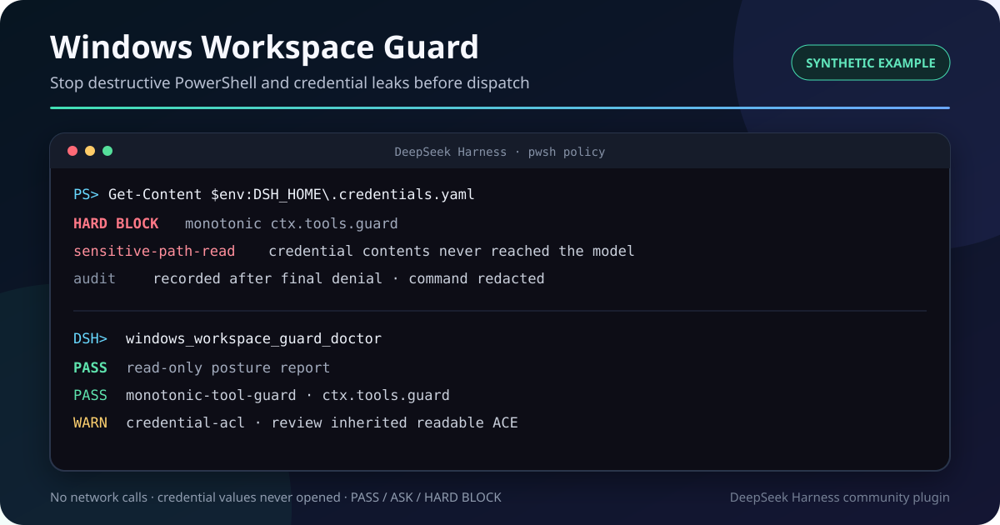

# Windows Workspace Guard for DeepSeek Harness

[中文](README.zh.md) | English

[](https://dshbase.com/plugins/dsh-windows-workspace-guard/) [](https://github.com/julescules/dsh-windows-workspace-guard/actions/workflows/ci.yml)

> [!IMPORTANT]
> Unofficial community plugin. Independently developed and maintained; not reviewed or endorsed by DeepSeek.

Stop a Windows agent before it deletes originals, escapes the workspace, destroys Git recovery paths, reads credentials, or changes system state. PowerShell and the official structured file editor receive a clear **PASS**, **ASK**, or **HARD BLOCK** before dispatch.



## Start in 30 seconds

```powershell
dsh plugin --profile web add github:julescules/dsh-windows-workspace-guard#v0.8.0
dsh --profile web --dump-config
dsh --profile web
```

Restart DSH, then ask:

```text
Run windows_workspace_guard_doctor, then use windows_workspace_guard_check
to inspect this command without executing it:
Get-Content -LiteralPath $env:DSH_HOME\.credentials.yaml
```

## Why v0.8.0

### Verified multi-tool boundary

The default protected set is now `pwsh` plus the official `str_replace_editor`. The editor adapter reads its structured `command` and `path` arguments, omits file content from policy previews, and applies the same workspace, immutable-path, existing-link, and sensitive-path rules to `create`, `str_replace`, `insert`, and sensitive `view` calls.

Configured tools without a verified argument adapter fail closed. Doctor reports every configured tool as `covered` or `unsupported`; the plugin never treats an unknown schema as PowerShell and calls it protected.

Upgrades preserve live settings. If an older profile already stored `toolNames: [pwsh]`, add `str_replace_editor` in the settings card; Doctor will show the effective coverage.

### Monotonic hard blocks

Workspace escapes and unverifiable mutation paths are hard blocks. `allowExact` remains available for explicit review-level commands, but it cannot authorize a write outside the configured workspace or bypass any non-overridable policy.

Static non-overridable rules are also registered through the official synchronous `ctx.tools.guard()` seam. They remain denials even if another reorderable `tools/pre-execute` listener short-circuits its waterfall. Older Harness builds without that API keep the pre-execute fallback.

Live junction/symlink inspection remains asynchronous in `tools/pre-execute`; it cannot be moved into a synchronous guard and is reported honestly as a separate layer.

### Credential and secret boundary

With `guardSensitiveData: true` (default), the guarded `pwsh(command)` boundary blocks explicit reads or copies of:

- `$DSH_HOME\.credentials.yaml` and `.env` files;
- user SSH, AWS, Azure, Git, npm, GitHub CLI, and NuGet credential locations;
- configured `sensitivePaths`;
- sensitive environment variables and full `Env:` enumeration;
- same-command outbound-network use combined with an explicit sensitive source.

This is a conservative tool boundary, not a general DLP system. It does not inspect arbitrary native-process memory, already-running processes, or tools outside `toolNames`.

### Read-only Windows doctor

`windows_workspace_guard_doctor` reports facts without changing ACLs or configuration:

- `ctx.tools.guard()` availability;
- configured-tool coverage and adapter type;
- DSH home and configured workspace/protected path state;
- existing link metadata for configured roots;
- audit-path writability and bounded duplicate-runtime checks;
- credential-file ACL metadata on Windows, without opening credential contents.

## Decisions

| Result | Meaning |
|---|---|
| PASS | No matched risk under the active policy. |
| ASK | A reviewable operation needs one host approval in `mode: ask`. |
| HARD BLOCK | Disk/system mutation, policy bypass, immutable path, link traversal, or sensitive-data access cannot be approved away. |

Use `windows_workspace_guard_check` for a dry run. Select `pwsh` with `command`, or `str_replace_editor` with an operation plus absolute `path`; it returns machine-readable findings and never executes the call.

## Main settings

The DSH Web settings card updates these values live:

```yaml
enabled: true
mode: block               # block | ask | report
toolNames: [pwsh, str_replace_editor]
workspaceRoots: []        # empty = current session cwd
protectedPaths: []
guardExistingLinks: true
guardSensitiveData: true
sensitivePaths: []
auditPath: ''             # optional append-only JSONL
auditIncludeCommand: false
auditFailClosed: false
```

With an audit path, dispatch writes occur after host approval and monotonic guards. Denied calls are observed after their final result. Commands are hashed and redacted by default.

## DSH integration

The package stays outside Harness core and uses the official `dsh.bundle.patch`, `tools/pre-execute`, `ctx.tools.guard()`, `tools/execute`, `tools/result`, settings, and typed-tool seams.

## Upgrade, disable, uninstall

```powershell
dsh plugin --profile web add github:julescules/dsh-windows-workspace-guard#v0.8.0
dsh plugin --profile web list
dsh plugin --help
```

Use the disable/remove command shown by `dsh plugin --help` for your Harness build, then restart DSH. Profile command names are still changing during developer preview.

## Troubleshooting and data

- Missing settings card: run `dsh --profile web --dump-config`, confirm `windows-workspace-guard`, then restart Web.
- False positive: run the dry-run tool and report finding IDs plus a redacted command/path.
- The plugin makes no network requests. Doctor reads filesystem/ACL metadata only and never credential values.
- No audit file is created unless `auditPath` is configured.
- Keep `workspaceRoots` and `sensitivePaths` absolute and narrow.

## Verify

```powershell
npm run check
npm pack --dry-run
node scripts/build-release-metadata.mjs .\dsh-windows-workspace-guard-0.8.0.tgz .\builds\v0.8.0
.\scripts\verify-release.ps1 -PackagePath .\dsh-windows-workspace-guard-0.8.0.tgz -ChecksumsPath .\builds\v0.8.0\SHA256SUMS
```

Each release ships a SHA-256 checksum and CycloneDX SBOM. The verifier reads files literally and makes no network request.

## Limits

- Static policy is not an operating-system sandbox.
- A filesystem TOCTOU window remains between link inspection and execution.
- Tools outside `toolNames` are not covered; configured names with unknown argument schemas fail closed and appear as Doctor warnings.
- ACL warnings are review evidence, not automatic permission repair.

For missed cases, reply in the [official community plugin thread](https://github.com/deepseek-ai/deepseek-harness/discussions/2429) with Windows, PowerShell and DSH versions, a redacted command, expected PASS/ASK/BLOCK, and redacted doctor output.

See [CONTRIBUTING.md](CONTRIBUTING.md) and [SECURITY.md](SECURITY.md).

## License

[MIT](LICENSE)
